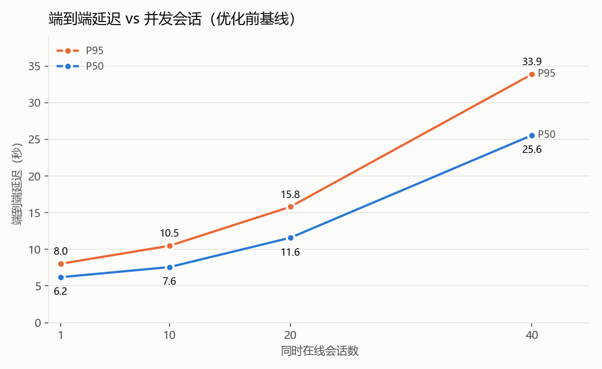
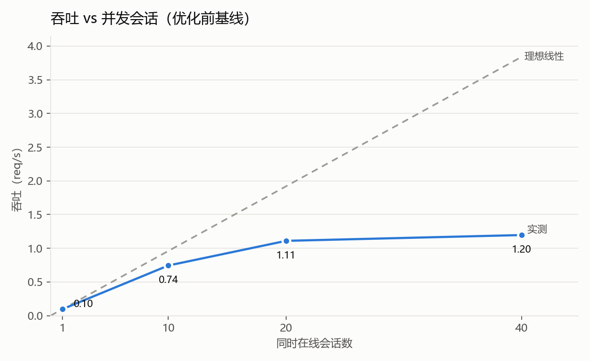
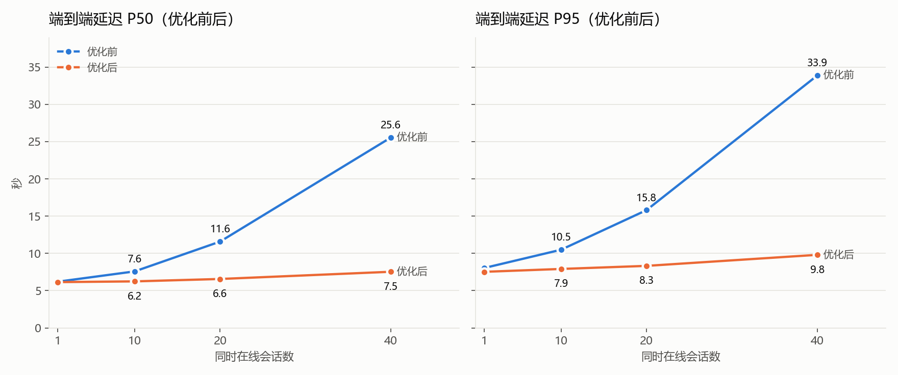
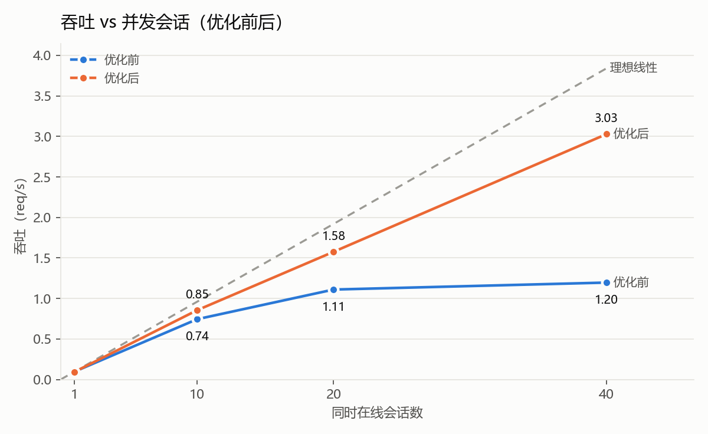
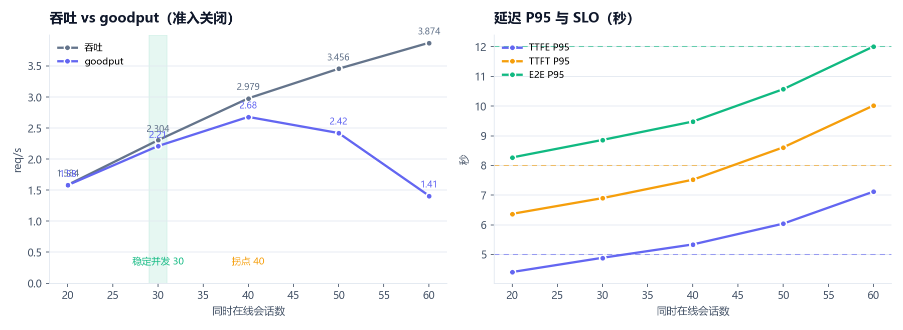
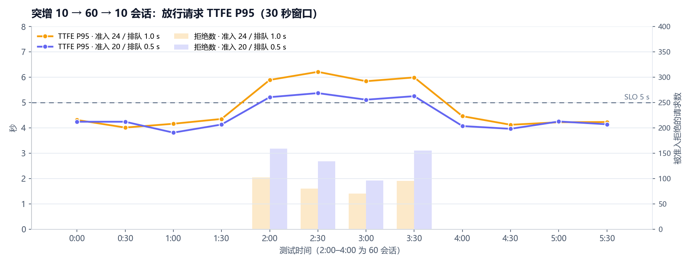
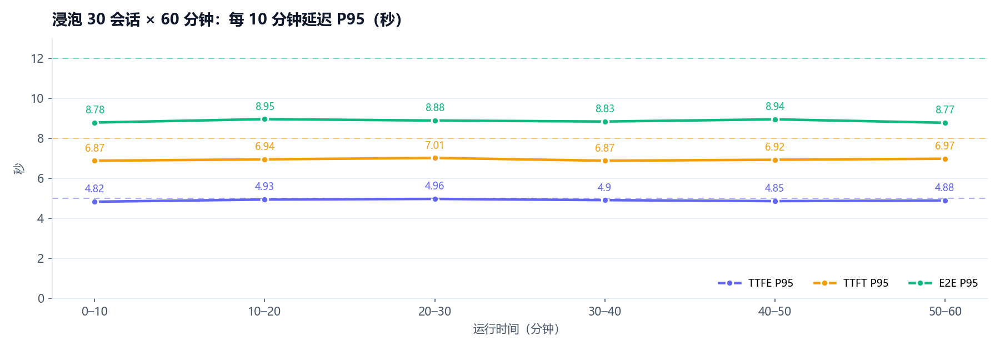

# WOW-ReAct-Agent 系统并发压测项目：

> 多轮会话 RAG + ReAct Agent 系统的生产级上线压测模块：
> 
> **① 基准获取/替身填充/SLO预定义 → ② 压测前后端优化 → ③ 正式压测（6维度）→ ④ 指标汇总 → ⑤ 准入、舱壁等参数调优**

**压测目的**：
  1. **能扛多少**：系统在满足延迟 SLO（TTFE / TTFT / E2E P95）的前提下，稳定支持多少并发会话？
  2. **卡在哪里**：并发上升时，瓶颈在事件循环、线程池、GPU 还是云端主模型？
  3. **扛不住怎么办**：流量突增、长时间运行时系统是否稳定？限流、准入、舱壁等参数该设多少？

## **核心指标**

| 指标 | 基线 · 40 会话 | 压测后 · 40 会话 | 压测后 · 30 会话（稳定并发） | 变化 |
|---|---:|---:|---:|---:|
| **QPS** 吞吐（req/s） | 1.20 | 3.03 | 2.43 | **×2.5** |
| **goodput**（满足 SLO 的 req/s） | 0.003 | 2.65 | 2.34 | **0 → 2.65** |
| **TTFT P95** 首字延迟（s） | 24.96 | 7.79 | 6.93 | **−69%** |
| **ITL P95** 出字间隔（s，≈TPOT） | 0.288 | 0.047 | 0.047 | **−84%** |
| **GPU** 平均利用率 | 77% | 99.6% | 92% | 算力用满 |

## **核心结论**

| 结果 | 数值 | 说明 |
|---|---|---|
| 稳定并发 | **30 会话** | TTFE / TTFT / E2E P95 全部达标 |
| 突增 10 → 60 会话（6 倍） | **goodput +79%** | 0 个系统错误，冲击结束后 30 秒内恢复 |
| 浸泡 30 会话 × 60 分钟 | **0 错误** | 8,805 请求，无泄漏，延迟不随时间退化 |
| 负载下答案质量 |**无显著变化（5 项 RAGAS 评分差值 ≤ ±0.022，p ≥ 0.32）** | 抽样压测数据与飞轮 RAGAS 结果逐条计算 |

---

## 1、压测准备 · 压测档位 · SLO 标准定义

### 压测准备

- **压测数据**：245，来自数据飞轮 Round 3 真实用户对话。
- **多轮对话压测**：每会话 1–5 轮，轮间思考 8s。每会话独立 user_id / session_id 全局唯一。
- **主模型替身**：主模型 Qwen3-30b-a3b api（RPM：600 / TPM：1，000,000）。第 1 步到 3.4 用本地替身代替 API 主模型进行压测，3.5-3.6 时切回真实百炼。
- **替身参数**：按飞轮期间 Langfuse 记录的 864 次真实调用校准首字延迟、思考 token 数、答案长度和出字速度，全程固定不改。
- **替身只替换主模型**：vLLM Qwen3-4B / 1.7B、TEI 重排、ONNX 嵌入、Milvus、Redis、PostgreSQL、Neo4j 全部真实运行。
- **压测开关**：关闭缓存、在线 RAGAS、联网搜索，放开全局与单查询限流，让每个请求走完整链路；单用户限流与熔断保留。

### 压测档位

| 步骤 / 方法 | 负载模型 | 档位 | 每档时长 |
|---|---|---|---|
| ① 基线 / ② 优化回归 | 闭环多轮 | 1 · 10 · 20 · 40 会话 | 5 min |
| 3.1 并发阶梯 | 闭环多轮，准入关闭 | 20 · 30 · 40 · 50 · 60 会话 | 5 min |
| 3.2 恒定速率 | 开环，会话泊松到达 | 0.6 · 0.9 会话/s | 5 min |
| 3.3 突增 | 分阶段闭环，准入开启 | 10 → 60 → 10 会话 | 各 2 min |
| 3.4 浸泡 | 闭环多轮，准入开启 | 30 会话 | 60 min |
| 3.5 真实模型 | 闭环多轮，真实百炼 | 1 · 10 · 20 会话 | 5 / 5 / 10 min |

- **冷却**：档间停 60 s，清空在途请求与后台记忆写入；每档到时后不再发起新请求，最多等 120 s 让在途请求完成。
- **预热**：每轮开始前先跑冒烟请求，加载模型与连接；每档起点所有会话同时启动，存在一个瞬时峰值。

### SLO 标准定义

| 指标 | 含义 | 无负载 P95 | 倍数 | **SLO（P95）** | 真实百炼复核 |
|---|---|---:|---:|---:|---:|
| TTFE | 首个流式事件 | 4.10 s | ×1.2 | **≤ 5 s** | 4.5 s |
| TTFT | 首个答案字 | 5.67 s | ×1.4 | **≤ 8 s** | 9.4 s |
| E2E | 端到端完成 | 7.53 s | ×1.6 | **≤ 12 s** | 12.1 s |
| 错误率 | 不含准入 503 | — | — | **≤ 1%** | — |

- **定法**：取优化后 1 会话（无负载）的 P95 乘以容忍倍数后取整；越靠前的阶段倍数越严，因为用户对首屏最敏感。
- **复核**：接入真实百炼后用同一方法重算，差异 < 20%，**SLO 保持不变**，全程用同一把尺子横向比较。
- **定档**：按同一 SLO 判定稳定并发——替身环境 **30 会话**，真实环境约 **28 会话**；准入参数最终定为 **20 / 0.5 s**（见第 5 步）。

---

## 第 1 步：基准获取 —— 改造前基线与瓶颈定位

> 改造前只有 1 会话达标，40 会话时 TTFT P95 达 **25.0 s**、goodput 几乎为 **0**。

> **根因**：单 worker 事件循环被同步调用串行化，查询改写为串行调用，长期记忆 embedding 行为为串行调用。

     
---

## 第 2 步：压测前后端优化

  | 类别 | 问题 | 做法 | 结果 |
  |---|---|---|---|
  | **事件循环去阻塞** | 改写、ONNX 嵌入同步执行，阻塞事件循环 | 改写、嵌入放入线程池 | 4B 串行 →并行 / ITLP95 0.288 →0.047 s |
  | **线程池扩容** | LangGraph ToolNode 的同步检索器跑在默认线程池，8 核仅 12 线程 | 扩至 64 | 60 会话峰值用到 53 线程 |
  | **连接池扩容** | TEI / 判定连接池仅 10，压测中打满出现告警 | requests 64 httpx 64 / 32 ·PG 30 | 打满告警 4 次 →0 |
  | **CPU 争抢** | 嵌入每次 4 线程，并发推理超订 8 核 | 线程 4 →2 | 预防性调整 |
  | **静默失败** | 1.7B `max-model-len=1024`，长期记忆抽取 113 条返回 400 且无日志 | 扩至 2048，失败记日志 | 400 错误 113 →0 |
  | **并发竞态** | 首请求懒加载，并发下可能重复初始化 | 启动时预初始化 加锁 + 双重检查 | 系统错误 0 |
  | **过载保护** | 无准入、隔离、超时，过载时全部变慢 | 准入控制 ·依赖舱壁 60 s 截止 ·10% 重试预算 | 6 倍突增 0系统错误 goodput 1.41 →2.52 |

**优化后曲线**：

     

---

## 第 3 步：压测执行 —— 6 维度压测

> 3.1–3.4 在服务器替身环境测**系统本身的容量与稳定性**；3.5–3.6 切回真实百炼，测**真实容量与回答质量**。

| 方法 | 做法 | 回答的问题 | 结论 |
|---|---|---|---|
| 3.1 并发阶梯 | 闭环 10/20/30/40/50/60 会话，准入关闭 | 容量上限与拐点 | 稳定并发 30 · 拐点 40 |
| 3.2 恒定速率 | 开环，泊松到达 0.6 / 0.9 会话/s | 给定流量能否达标 | 2.4 req/s 达标 |
| 3.3 突增 | 10 → 60 → 10 会话，准入开启 | 冲击下是否稳定 | 0 错误 · goodput +79% |
| 3.4 浸泡 | 30 会话持续 60 分钟 | 泄漏与性能退化 | 0 错误 · 无泄漏 |
| 3.5 真实模型 | 切回百炼，1 / 10 / 20 会话 | 替身是否可信、真实容量 | 真实稳定并发约 28 |
| 3.6 负载下质量 | 20 会话负载中重答 60 题，离线 RAGAS评估 | 高负载是否降低质量 | 5项 RAGAS 指标无显著变化 |

### 3.1 · 3.2 并发阶梯 + 恒定速率：稳定并发 30 会话，goodput 拐点 40 会话

> 吞吐一直涨到 60 会话，但 goodput 在 **40 会话见顶**后下降。三项 SLO 全部达标的稳定并发是 **30 会话**。阶梯测试时关闭准入控制。

  

| 会话 | 请求 | 吞吐 | goodput | 达标率 | TTFE95 | TTFT95 | E2E95 | 在途 P95 | GPU | SLO |
|---:|---:|---:|---:|---:|---:|---:|---:|---:|---:|:---|
| 20 | 520 | 1.584 | 1.578 | 99.6% | 4.41 | 6.37 | 8.27 | 15 | 74% | ✅ |
| **30** | 746 | 2.304 | 2.214 | 96.1% | 4.89 | 6.90 | 8.86 | 22 | 96% | ✅ **稳定并发** |
| 40 | 967 | 2.979 | **2.680** | 90.0% | 5.34 | 7.52 | 9.48 | 26 | 96% | ❌ **拐点**（TTFE 超） |
| 50 | 1137 | 3.456 | 2.416 | 69.9% | 6.04 | 8.61 | 10.57 | 36 | 100% | ❌ |
| 60 | 1258 | 3.874 | 1.410 | 36.4% | 7.12 | 10.02 | 12.01 | 45 | 100% | ❌ |

| 恒定速率（开环） | 实际请求速率 | goodput | 达标率 | TTFE95 | TTFT95 | E2E95 | SLO |
|---|---:|---:|---:|---:|---:|---:|:---:|
| 0.6 会话/s | 1.71 req/s | 1.56 | 99.0% | 4.58 | 6.48 | 8.28 | ✅ |
| 0.9 会话/s | 2.41 req/s | 2.05 | 95.3% | 4.97 | 6.99 | 8.73 | ✅ |

- **瓶颈**：GPU 算力（30 会话起 96–100%），其次是单 worker 的 Python CPU（50 会话起超过 100%，事件循环延迟最大 269 ms）。
- **开环**：用户不因系统变慢而少来，更接近真实流量；2.4 req/s 下仍达标，与闭环 30 会话结论一致。
- 60 会话仍 **0 错误**，内存 1008 MiB → 1.05 GiB，无崩溃迹象。

### 3.3 突增测试：10 → 60 → 10 会话（6 倍流量冲击）

> 准入控制削掉超出容量的请求，留下的请求服务得更好：goodput **1.41 → 2.52 req/s**，**0 个非准入错误**，回落后 30 秒内恢复。对比了两组准入参数（在途上限 / 排队超时）。

  

| 60 会话冲击期 | 无准入（3.1 的 60 会话） | 24 / 1.0 s | **20 / 0.5 s** |
|---|---:|---:|---:|
| 放行请求 TTFE P95 | 7.12 | 6.01 | **5.25** |
| 放行请求 TTFT / E2E P95 | 10.02 / 12.01 | 8.17 / 10.15 | **7.37 / 9.51** |
| 放行请求中满足 SLO 的比例 | 36.4% | 68.7% | **89.6%** |
| 拒绝率 | 0 | 46.9% | 61.7% |
| 拒绝响应时间 P50 | — | 1.01 s | **0.51 s** |
| **goodput（req/s）** | 1.41 | 2.25 | **2.52** |

- **不崩溃**：两组都是 0 个非准入错误，被拒请求快速收到"系统繁忙"，不会长时间挂起。
- **立即恢复**：回落后第一个 30 秒窗口，TTFE P95 即回到冲击前水平（4.46 / 4.07 s），无残留积压。
- **准入控制 20 / 0.5 s 更优**：放行延迟更低，达标比例 69% → 90%，被拒请求一半时间就得到答复；放行 TTFE P95 5.25 s 仍略超 5 s。

### 3.4 浸泡测试：30 会话持续运行 60 分钟

> 8,805 个请求 **0 错误**，SLO 全程达标，延迟不随时间变慢，资源无泄漏。

  

| 检查项 | 结果 |
|---|---|
| 请求 / 错误 | 8,805 / 0 ✅ |
| TTFE / TTFT / E2E P95 | 4.90 / 6.93 / 8.86 s ✅ |
| 达标率 / goodput | 96.1% / 2.34 req/s |
| app 内存 | 1290 → 1282 MB，无增长 ✅ |
| 线程池 | 恒 25 线程，排队 ≤ 12 ✅ |
| 结束后在途 / 后台任务 | 0 / 0，无准入名额泄漏 ✅ |
| 舱壁 / 重试预算拒绝 | 0 / 0 ✅ |
| 准入拒绝 | 11 次（0.12%），其中 10 次在 30 个会话同时启动的瞬间 |

- 与 3.1 中 30 会话的 5 分钟结果几乎一致（TTFE P95 4.90 vs 4.89），**短测能代表长期运行**。
- **事故记录**：首次浸泡在第 26 分钟因系统盘写满中断（同机部署的 Langfuse ClickHouse 系统日志）。先打系统盘快照，再在线扩容 50 GB 后完整重跑，上表为重跑结果。

### 3.5 真实模型验证：主模型从本地替身切回阿里云百炼

| 会话 | 环境 | 请求 | TTFE95 | TTFT95 | E2E95 | ITL P50 | 达标率 | SLO |
|---:|---|---:|---:|---:|---:|---:|---:|:---:|
| 1 | 替身 | 30 | 4.10 | 5.67 | 7.53 | 0.045 | 100% | ✅ |
| 1 | **真实** | 30 | 3.73 | 6.69 | 7.57 | 0.027 | 100% | ✅ |
| 10 | 替身 | 268 | 4.16 | 5.91 | 7.91 | 0.045 | 99.6% | ✅ |
| 10 | **真实** | 263 | 5.05 | 8.58 | 9.42 | 0.028 | 98.2% | ✅ |
| 20 | 替身 | 520 | 4.41 | 6.37 | 8.27 | 0.045 | 99.6% | ✅ |
| 20 | **真实** | 966 | 5.75 | 9.35 | 10.29 | 0.032 | 93.2% | ✅ |
| 30 | 替身 | 746 | 4.55 | 6.77 | 8.86 | 0.045 | 96% | ✅ |
| 30 | **真实** | 966 | 6.89 | 9.95 | 11.42 | 0.050 | 91.2% | ✅拐点 |

- **替身偏差**：真实模型拐点出现在 30 并发。真实模型首字前更慢、出字更快（ITL 0.027 vs 0.045 s），20 会话 E2E P50 只慢约 0.8 s。

### 3.6 负载下回答质量：60 题 RAGAS 与 R3 无负载对比

> 真实 20 会话负载进行时，评估脚本以全新用户串行重答 R3 评估集中分层抽取的 60 题（简单 31 / 推理 24 / 多跳 5），用与 R3 相同的评判模型 qwen-plus 和提示词 zh_v2 离线计算 RAGAS，与 R3 无负载同题分数对比。60 题全部答完，无空答案、无检索片段缺失。

  | 指标 | R3 同题（无负载） | 负载下 | 变化 | 配对检验 p |
  |---|---:|---:|---:|---:|
  | Faithfulness | 0.723 | **0.751** | +0.022 | 0.40 |
  | Answer Relevancy | 0.829 | **0.840** | +0.011 | 0.99 |
  | Context Precision | 0.956 | **0.972** | +0.017 | 0.32 |
  | Context Recall | 0.900 | **0.894** | −0.006 | 0.85 |
  | Answer Correctness | 0.634 | **0.641** | +0.011 | 0.63 |

  **负载答案质量**：逼近飞轮评估质量，无显著变化（5 项 RAGAS 评分差值 ≤ ±0.022，p ≥ 0.32）

---

## 第 4 步：压测指标汇总

**关键延迟**（P95 / P50，单位秒）

| 指标 | SLO | 基线 · 40 会话 | 优化后 · 40 会话 | 稳定并发 · 30 会话（浸泡 60 min） | 真实百炼 · 30 会话（API波动较大） |
|---|---:|---:|---:|---:|---:|
| TTFE 首个事件 | ≤ 5 | ❌ 20.33 / 13.13 | ❌ 5.54 / 4.02 | ✅ 4.90 / 3.65 | ❌ 5.05 / 3.69 |
| TTFT 首个答案字 | ≤ 8 | ❌ 24.96 / 19.97 | ✅ 7.79 / 6.03 | ✅ 6.93 / 5.53 | ❌ 8.58 / 5.99 |
| E2E 端到端 | ≤ 12 | ❌ 33.89 / 25.56 | ✅ 9.81 / 7.54 | ✅ 8.86 / 7.04 | ✅ 9.42 / 6.65 |
| ITL 出字间隔 | — | ⚠️ 0.288 / 0.108 | 0.047 / 0.045 | 0.047 / 0.045 | 0.036 / 0.028 |

---

## 第 5 步：参数调优

| 参数 | 原值 | **定稿** | 依据 |
|---|---:|---:|---|
| 准入在途上限 | 30 | **20** | 阶梯拐点先给出 24（30 会话在途 P95 22 达标、40 会话 26 超标）；突增对比中 20 冲击期全面更优；真实环境稳定并发约 8 会话（在途 5–6），正常负载碰不到 20，只在过载时生效 |
| 准入排队超时 | 2.0 s | **0.5 s** | 排队时间计入 TTFE；0.5 s 让被拒请求更快得到答复，冲击期 goodput +12% |
| 依赖舱壁 | 无 | **12 / 6 / 2 / 16** | 改写 / 判定 / 后台 / TEI；前三项合计等于 4B 的 max-num-seqs 20；所有轮次舱壁拒绝为 0 |
| 重试（改写 / 主 LLM） | 3 / 2 | **2 / 1** | 重试会放大过载流量；另加 10% 重试预算，压测中预算拒绝为 0 |
| 请求截止 | 无 | **60 s** | P2 部署后各轮最大 E2E 19.0 s，未触发；用于兜底挂起请求 |
| 限流 / 缓存 | 开 | 恢复开启 | 压测时关闭以测完整链路；并发由准入控制，RPS 限流只防刷 |

**取舍**：上限 20 时，替身环境满载 30 会话有 21.5% 的时间在途 ≥ 20，会出现排队和拒绝（上限 24 时为 1.2%）。最终按实际部署的真实百炼取 20。

---

## 压测局限

- **替身**：替身参数来自单轮数据，不随并发变慢、不返回 429；已用 3.5 的真实模型对照量化偏差。
- **单卡**：vLLM qwen3-4B、qwen-31.7B、TEI 共用一块 A10，结论只适用于单卡部署。
- **保守**：压测关闭缓存，线上命中缓存的请求不走主模型，实际容量更高。

